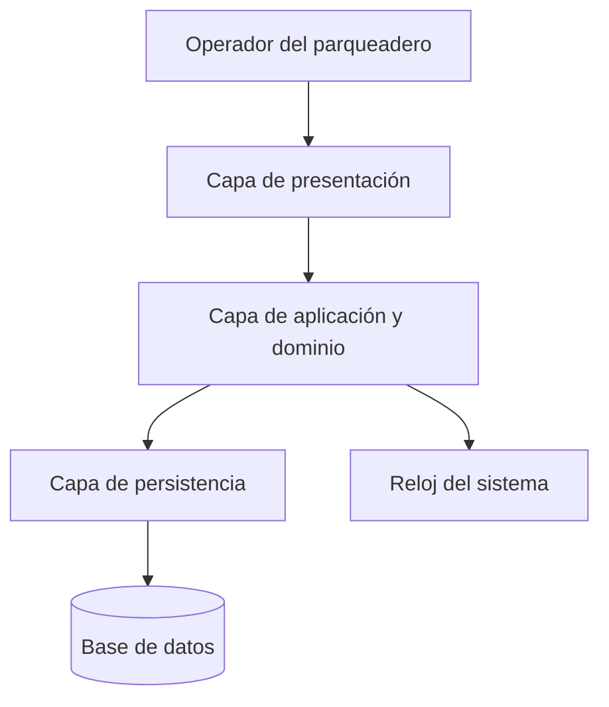
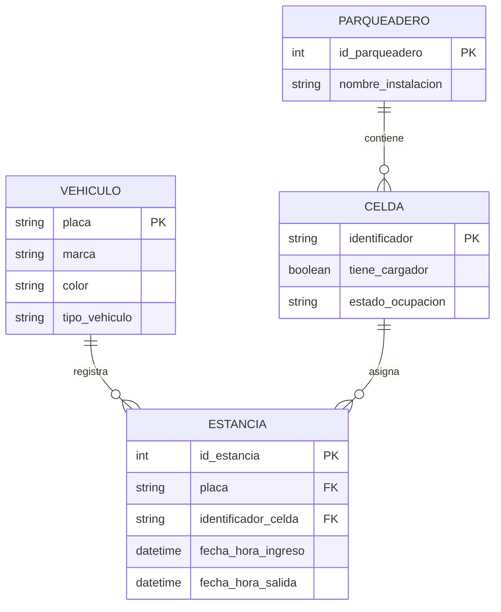

# DES-001 - Diseño del Sistema

## 0. Información del elemento de configuración

| Campo | Información |
|---|---|
| Código | DES-001 |
| Nombre | Diseño del Sistema SmartParking |
| Versión | 1.2 |
| Estado |Aprobado para BL-003 |
| Sistema | SmartParking - Gestión de Parqueadero |
| Fecha | 2026-10-06 |
| Responsable | Equipo SmartParking |
| Responsable del cambio | alexagr210 |
| Responsable del cambio | albeirosr |

Nota de actualización documental — 06/10/2026: se actualiza el estado del documento a En modificación, conforme a la solicitud de cambio CR-002 (Vehículos eléctricos y celdas con cargador). Se evoluciona el modelo entidad-relación, el diccionario de datos, las reglas de negocio y los flujos operacionales. Responsable de la actualización: alexagr210.

## 1. Propósito

Definir el diseño de la versión evolucionada de SmartParking. El documento describe la estructura del sistema, los datos que debe conservar, las operaciones, las validaciones y la relación entre las decisiones de diseño y los requisitos aprobados tras la incorporación de la solicitud de cambio CR-002.

Este diseño sirve como referencia para la implementación posterior. No establece un lenguaje de programación, un framework ni un motor de base de datos.

## 2. Alcance y decisiones de diseño

La versión 1.2 permite registrar vehículos clasificando su motorización, registrar sus ingresos (con asignación automatizada y priorización de celdas eléctricas), registrar salidas liberando el espacio, consultar la disponibilidad discriminada por tipo de celda, calcular la permanencia y consultar los datos y el estado de un vehículo por su placa. Incluye las validaciones necesarias para que estas operaciones sean coherentes.

Se mantienen las restricciones respecto a las reservas permanentes de espacios, las cuales no se incorporan por no estar aprobadas. Tampoco se incluyen funciones de cobro ni administración de usuarios.

Las siguientes decisiones concretan el diseño sin modificar los requisitos:

| Decisión | Justificación |
|---|---|
| Utilizar la placa como identificador único del vehículo. | Las operaciones de registro, ingreso, salida y consulta identifican el vehículo mediante su placa. |
| Representar cada visita mediante una estancia que reúne ingreso y salida. | Permite asociar cada salida con su ingreso y conservar múltiples visitas del mismo vehículo. |
| Considerar activa una estancia sin fecha y hora de salida. | Permite determinar el estado actual y contar los vehículos dentro del parqueadero. |
| Derivar el estado del vehículo y la disponibilidad de las estancias activas. | Evita almacenar valores duplicados que puedan quedar desactualizados. |
| Capturar las fechas y horas desde el reloj del sistema. | Mantiene un criterio temporal uniforme para los registros de ingreso y salida. |
| Definir la capacidad por tipos de celda de forma paramétrica. | Es indispensable para calcular la disponibilidad discriminada (comunes vs eléctricas). |
| Implementar un algoritmo de asignación automática de espacios por prioridad. | Da cumplimiento a la regla de asignación de CR-001 y a la prioridad eléctrica de CR-002. |

Antes de la puesta en funcionamiento se debe establecer la capacidad de celdas comunes, celdas eléctricas y la zona horaria del parqueadero. Estas son condiciones de configuración técnica. La capacidad parametrizada debe permanecer estable durante las operaciones de la versión.

## 3. Architecture del sistema

Se propone una aplicación organizada en tres capas, con una base de datos relacional persistente. Las capas son divisiones lógicas y no requieren servidores independientes.

| Capa | Responsabilidades |
|---|---|
| Presentación | Mostrar las operaciones principales, recoger datos, validar campos obligatorios y presentar resultados o errores comprensibles. |
| Aplicación y dominio | Coordinar los casos de uso, aplicar las reglas de negocio (incluyendo prioridades de asignación), obtener las marcas de tiempo y calcular disponibilidad y permanencia. |
| Persistencia | Guardar y consultar vehículos, celdas y estancias, gestionar transacciones y proteger las restricciones de integridad. |

La presentación solicita operaciones a la capa de aplicación y no modifica directamente la base de datos. Las reglas se verifican en la aplicación aunque la interfaz ya haya validado los datos.

### 3.1. Componentes principales

| Componente | Responsabilidad |
|---|---|
| ServicioVehiculos | Registrar vehículos (guardando su tipo) y consultar sus datos y estado por placa. |
| ServicioEstancias | Registrar ingresos con asignación lógica automática, cerrar estancias al registrar salidas y obtener la permanencia. |
| ServicioDisponibilidad | Consultar la capacidad desglosada y contar estancias activas por tipo de celda para calcular los espacios libres. |
| RepositorioVehiculos | Guardar vehículos y recuperarlos por placa incluyendo su tipo de motorización. |
| RepositorioEstancias | Crear estancias, buscar la estancia activa, registrar la salida y recuperar una estancia por identificador. |
| RepositorioCeldas | Administrar el inventario físico de celdas, parametrizar la presencia de cargadores eléctricos y mutar el estado de ocupación. |
| RelojSistema | Proporcionar la fecha y hora actual para los registros. |

Los servicios utilizan una misma unidad de transacción cuando una operación necesita varias consultas o escrituras. La persistencia no contiene decisiones sobre mensajes de interfaz.

## 4. Modelo de datos

### 4.1. Entidades y relaciones

Un vehículo puede tener varias estancias históricas, pero como máximo una activa. Cada estancia se asocia a una celda específica del parqueadero universitario. La entidad Celda discrimina de forma lógica si posee infraestructura de carga o no.

### 4.2. Diccionario de datos

| Entidad | Atributo | Tipo lógico | Restricciones y significado |
|---|---|---|---|
| Vehículo | placa | Texto | Clave primaria; obligatoria, única y normalizada. |
| Vehículo | marca | Texto | Obligatoria; no puede estar vacía. |
| Vehículo | color | Texto | Obligatorio; no puede estar vacío. |
| Vehículo | tipo_vehiculo | Texto | Obligatorio. Valores restringidos: 'Convencional' o 'Eléctrico'. [CR-002] |
| Celda | identificador | Texto | Clave primaria única para cada espacio físico (Ej: 'A-01'). |
| Celda | tiene_cargador | Booleano | Obligatorio. True si posee infraestructura de carga activa. [CR-002] |
| Celda | estado_ocupacion | Texto | Obligatorio. Valores: 'Libre' o 'Ocupado'. |
| Estancia | id_estancia | Entero | Clave primaria generada automáticamente por el sistema. |
| Estancia | placa | Texto | Clave foránea obligatoria hacia Vehículo. |
| Estancia | identificador_celda| Texto | Clave foránea obligatoria hacia Celda. Indica el espacio asignado. |
| Estancia | fecha_hora_ingreso | Fecha y hora | Obligatoria; instante en que se registra el ingreso. |
| Estancia | fecha_hora_salida | Fecha y hora, admite nulo | Nula mientras la estancia esté activa; al cerrarse debe ser >= al ingreso. |
| Parqueadero | id_parqueadero | Entero | Clave primaria del parqueadero universitario configurado. |

La fecha y la hora de cada movimiento se almacenan juntas para conservar el instante completo. Se propone persistir los instantes en UTC y mostrarlos en la zona horaria configurada.

La placa se normaliza quitando espacios exteriores y convirtiendo las letras a mayúsculas, tanto al registrar como al consultar. Marca y color conservan el texto ingresado después de quitar espacios exteriores.

### 4.3. Restricciones de integridad

- La placa no puede repetirse en Vehículo.
- El identificador de la Celda debe ser único en el sistema.
- Una estancia solo puede referenciar un vehículo registrado y una celda física parametrizada.
- Un vehículo no puede tener más de una estancia con salida nula. La persistencia asegura esta unicidad ante solicitudes simultáneas.
- La salida no puede ser anterior al ingreso y una estancia cerrada no puede modificarse.
- Las estancias cerradas se conservan para mantener el historial. No se realizan eliminaciones en cascada.
- Los ingresos y las salidas se confirman mediante transacciones; si hay un fallo, la operación completa se revierte.
- Se consulta la disponibilidad sumando las celdas en estado_ocupacion = 'Libre' filtradas por el atributo tiene_cargador.

Se prevén índices para buscar vehículos por placa, filtrar celdas por estado e infraestructura, y rastrear estancias activas.

## 5. Estados y reglas de negocio

