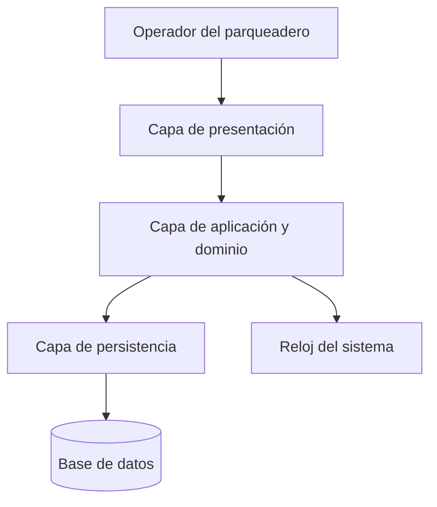
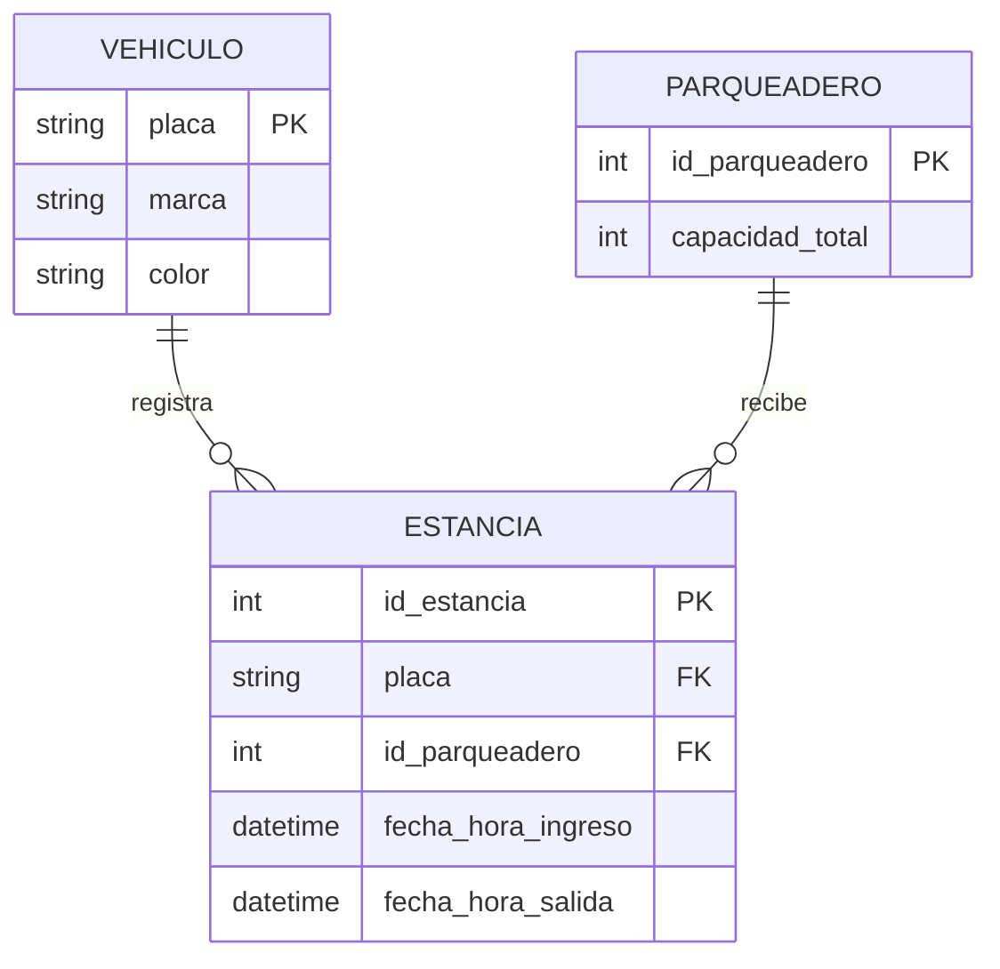
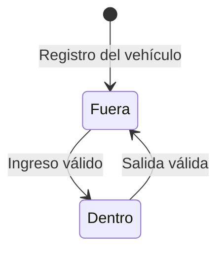
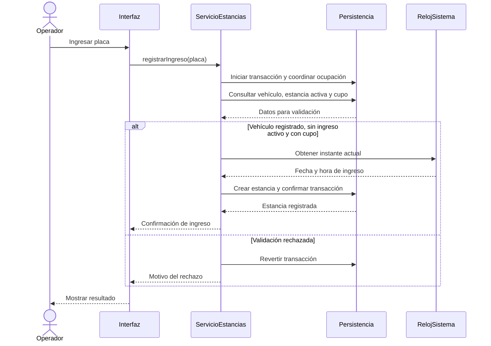

# DES-001 - Diseño del Sistema

## 0. Información del elemento de configuración

| Campo | Información |
|---|---|
| Código | DES-001 |
| Nombre | Diseño del Sistema SmartParking |
| Versión | 1.1 |
| Estado | Borrador para revisión |
| Sistema | SmartParking - Gestión de Parqueadero |
| Fecha | 2026-10-05 |
| Responsable | Equipo SmartParking |
| Responsable del cambio | Revant11y |

## 1. Propósito

Definir el diseño de la versión inicial de SmartParking. El documento describe la estructura del sistema, los datos que debe conservar, las operaciones, las validaciones y la relación entre las decisiones de diseño y los requisitos aprobados.

Este diseño sirve como referencia para la implementación posterior. No establece un lenguaje de programación, un framework ni un motor de base de datos.

## 2. Alcance y decisiones de diseño

La versión 1.0 permite registrar vehículos, registrar sus ingresos y salidas, consultar la disponibilidad, calcular la permanencia y consultar los datos y el estado de un vehículo por su placa. Incluye las validaciones necesarias para que estas operaciones sean coherentes.

Se mantienen las restricciones como sin la asignación automática de espacios, la gestión de vehículos eléctricos, la gestión de espacios con cargadores y las reservas permanentes. No se incorporan funciones de cobro ni administración de usuarios, porque no están especificadas.

Las siguientes decisiones concretan el diseño sin modificar los requisitos:

| Decisión | Justificación |
|---|---|
| Utilizar la placa como identificador único del vehículo. | Las operaciones de registro, ingreso, salida y consulta identifican el vehículo mediante su placa. |
| Representar cada visita mediante una estancia que reúne ingreso y salida. | Permite asociar cada salida con su ingreso y conservar múltiples visitas del mismo vehículo. |
| Considerar activa una estancia sin fecha y hora de salida. | Permite determinar el estado actual y contar los vehículos dentro del parqueadero. |
| Derivar el estado del vehículo y la disponibilidad de las estancias activas. | Evita almacenar valores duplicados que puedan quedar desactualizados. |
| Capturar las fechas y horas desde el reloj del sistema. | Mantiene un criterio temporal uniforme para los registros de ingreso y salida. |
| Definir la capacidad total como un parámetro inicial del parqueadero. | Es necesaria para calcular la disponibilidad. |

Antes de la puesta en funcionamiento se debe establecer la capacidad total, como entero positivo, y la zona horaria del parqueadero. Estas son condiciones de configuración técnica; no se propone una nueva función de administración. La capacidad debe permanecer estable durante las operaciones de la versión inicial.

## 3. Arquitectura del sistema

Se propone una aplicación organizada en tres capas, con una base de datos relacional persistente. Las capas son divisiones lógicas y no requieren servidores independientes.



| Capa | Responsabilidades |
|---|---|
| Presentación | Mostrar las operaciones principales, recoger datos, validar campos obligatorios y presentar resultados o errores comprensibles. |
| Aplicación y dominio | Coordinar los casos de uso, aplicar las reglas de negocio, obtener las marcas de tiempo y calcular disponibilidad y permanencia. |
| Persistencia | Guardar y consultar vehículos y estancias, gestionar transacciones y proteger las restricciones de integridad. |

La presentación solicita operaciones a la capa de aplicación y no modifica directamente la base de datos. Las reglas se verifican en la aplicación aunque la interfaz ya haya validado los datos.

### 3.1. Componentes principales

| Componente | Responsabilidad |
|---|---|
| ServicioVehiculos | Registrar vehículos y consultar sus datos y estado por placa. |
| ServicioEstancias | Registrar ingresos, cerrar estancias al registrar salidas y obtener la permanencia. |
| ServicioDisponibilidad | Consultar la capacidad y contar las estancias activas para calcular los espacios libres. |
| RepositorioVehiculos | Guardar vehículos y recuperarlos por placa. |
| RepositorioEstancias | Crear estancias, buscar la estancia activa, registrar la salida y recuperar una estancia por identificador. |
| RepositorioParqueadero | Leer la capacidad y coordinar el acceso concurrente a la ocupación mediante la configuración del parqueadero. |
| RelojSistema | Proporcionar la fecha y hora actual para los registros. |

Los servicios utilizan una misma unidad de transacción cuando una operación necesita varias consultas o escrituras. La persistencia no contiene decisiones sobre mensajes de interfaz.

## 4. Modelo de datos

### 4.1. Entidades y relaciones



Un vehículo puede tener varias estancias históricas, pero como máximo una activa. Cada estancia corresponde a un vehículo y al parqueadero configurado. La versión inicial utiliza un único parqueadero; la entidad Parqueadero permite almacenar su capacidad sin incluir gestión de múltiples instalaciones.

### 4.2. Diccionario de datos

| Entidad | Atributo | Tipo lógico | Restricciones y significado |
|---|---|---|---|
| Vehículo | placa | Texto | Clave primaria; obligatoria, única y normalizada. |
| Vehículo | marca | Texto | Obligatoria; no puede estar vacía después de quitar espacios exteriores. |
| Vehículo | color | Texto | Obligatorio; no puede estar vacío después de quitar espacios exteriores. |
| Estancia | id_estancia | Entero | Clave primaria generada por el sistema. |
| Estancia | placa | Texto | Clave foránea obligatoria hacia Vehículo. |
| Estancia | id_parqueadero | Entero | Clave foránea obligatoria hacia el parqueadero configurado. |
| Estancia | fecha_hora_ingreso | Fecha y hora | Obligatoria; instante en que se registra el ingreso. |
| Estancia | fecha_hora_salida | Fecha y hora, admite nulo | Nula mientras la estancia esté activa; al cerrarse debe ser mayor o igual al ingreso. |
| Estancia | espacioAsignacion| Espacio asignado | Obligatoria; instante en que se registra el ingreso. |
| Parqueadero | id_parqueadero | Entero | Clave primaria del único parqueadero configurado. |
| Parqueadero | capacidad_total | Entero | Obligatoria y mayor que cero. |

La fecha y la hora de cada movimiento se almacenan juntas para conservar el instante completo. Se propone persistir los instantes en UTC y mostrarlos en la zona horaria configurada. Esto permite calcular correctamente visitas que atraviesen la medianoche o duren varios días.

La placa se normaliza quitando espacios exteriores y convirtiendo las letras a mayúsculas, tanto al registrar como al consultar. No se impone un formato nacional de placa. Marca y color conservan el texto ingresado después de quitar espacios exteriores.

### 4.3. Restricciones de integridad

- La placa no puede repetirse en Vehículo.
- Una estancia solo puede referenciar un vehículo registrado y el parqueadero configurado.
- Un vehículo no puede tener más de una estancia con salida nula. La persistencia debe asegurar esta unicidad incluso ante solicitudes simultáneas; el mecanismo concreto depende del motor de base de datos seleccionado.
- La salida no puede ser anterior al ingreso y una estancia cerrada no puede cerrarse nuevamente.
- Las estancias cerradas se conservan para mantener la relación entre ingresos, salidas y permanencia. No se realizan eliminaciones en cascada del historial.
- Los ingresos y las salidas se confirman mediante transacciones; si hay un fallo, la operación completa se revierte.
- Se consulta la ocupación por estancias activas. No se mantiene un contador independiente de espacios disponibles.

Se prevén índices para buscar vehículos por placa, buscar estancias por placa y filtrar estancias activas por parqueadero. Su definición física se concretará al seleccionar el motor de base de datos.

## 5. Estados y reglas de negocio

Un vehículo registrado tiene uno de dos estados derivados: **Fuera del parqueadero**, cuando no tiene una estancia activa, o **Dentro del parqueadero**, cuando tiene una estancia activa. Un vehículo inexistente se informa como **Vehículo no registrado** y no se considera un vehículo en estado «Fuera».



| Regla de ESP-001 | Aplicación en el diseño |
|---|---|
| RN-001 | ServicioEstancias comprueba que la placa exista antes de crear una estancia. |
| RN-002 | Se rechaza el ingreso si ya existe una estancia activa del vehículo; la persistencia protege la unicidad. |
| RN-003 | Cada ingreso confirmado aumenta las estancias activas y cada salida confirmada las disminuye. |
| RN-004 | La permanencia se calcula restando el instante de ingreso al instante de salida de la misma estancia. |

Para un parqueadero con capacidad `C` y `A` estancias activas:

```text
espacios_ocupados = A
espacios_disponibles = C - A
0 <= A <= C
```

Como decisión de integridad asociada a RN-003, se rechaza un ingreso cuando no hay espacios disponibles. La comprobación de capacidad y la creación de la estancia deben pertenecer a la misma transacción. Esta validación evita una disponibilidad negativa y no asigna un espacio físico al vehículo.

La permanencia de una estancia cerrada se obtiene así:

```text
permanencia = fecha_hora_salida - fecha_hora_ingreso
```

El resultado es una duración no negativa, expresada en días, horas, minutos y segundos según corresponda. No se resta únicamente la hora del día. La permanencia se deriva de los instantes almacenados y no se guarda como dato independiente. Para una estancia activa se informa que todavía no existe una permanencia total finalizada.

## 6. Diseño de las operaciones

El actor principal es el operador del parqueadero. Este rol describe quién utiliza las funciones; no introduce un mecanismo de autenticación.

### 6.1. Registrar vehículo

**Requisito:** RF-001.

**Entrada:** placa, marca y color.

1. Normalizar la placa y quitar espacios exteriores de marca y color.
2. Validar que los tres campos estén completos.
3. Comprobar que la placa no esté registrada.
4. Guardar el vehículo respetando la unicidad de placa.
5. Mostrar la confirmación y los datos registrados.

**Resultado:** vehículo disponible para consultas y futuros ingresos, inicialmente fuera del parqueadero. Registrar un vehículo no ocupa un espacio.

**Excepciones:** campos incompletos, placa duplicada o fallo de almacenamiento. No se crea un registro parcial ni se sobrescribe un vehículo existente.

### 6.2. Registrar ingreso

**Requisitos:** RF-002 y RF-007. **Reglas:** RN-001, RN-002 y RN-003.

**Entrada:** placa.

1. Normalizar la placa e iniciar una transacción.
2. Coordinar el acceso a la ocupación del parqueadero y consultar el vehículo.
3. Rechazar el ingreso si el vehículo no está registrado.
4. Rechazar el ingreso si el vehículo ya tiene una estancia activa.
5. Consultar la capacidad y las estancias activas; rechazar el ingreso si no hay cupo.
6. Obtener el instante actual y crear la estancia con salida nula.
7. Confirmar la transacción y mostrar placa, fecha y hora de ingreso.

**Resultado:** vehículo dentro del parqueadero y un espacio disponible menos.

**Excepciones:** vehículo no registrado, ingreso ya activo, parqueadero lleno o fallo de persistencia. La operación rechazada no cambia la ocupación.



### 6.3. Registrar salida

**Requisitos:** RF-003 y RF-008. **Reglas:** RN-003 y RN-004.

**Entrada:** placa.

1. Normalizar la placa e iniciar una transacción con el mismo criterio de coordinación de ocupación usado para el ingreso.
2. Buscar la estancia activa del vehículo.
3. Rechazar la operación si no existe una estancia activa.
4. Obtener el instante actual y comprobar que no sea anterior al ingreso.
5. Guardar el instante de salida en esa estancia y calcular la permanencia.
6. Confirmar la transacción y mostrar placa, ingreso, salida y duración.

**Resultado:** estancia cerrada, vehículo fuera del parqueadero y un espacio liberado. El registro conserva la placa mediante su relación con Vehículo y el instante completo de salida.

**Excepciones:** vehículo no registrado, ausencia de ingreso activo, instante de salida inválido o fallo de persistencia. No se crea una salida sin ingreso ni se libera un espacio dos veces.

### 6.4. Consultar disponibilidad

**Requisito:** RF-004. **Regla:** RN-003.

**Entrada:** ninguna.

1. Leer la capacidad del parqueadero y contar sus estancias activas en una consulta consistente.
2. Calcular los espacios disponibles.
3. Mostrar capacidad total, espacios ocupados y espacios disponibles.

**Resultado:** disponibilidad correspondiente al momento de la consulta. Si se registra posteriormente otro movimiento, una nueva consulta refleja la nueva ocupación.

Si no se ha configurado una capacidad válida o los datos incumplen la relación `0 <= A <= C`, se informa que no es posible calcular una disponibilidad válida; no se muestra un valor inventado ni se oculta la inconsistencia.

### 6.5. Calcular tiempo de permanencia

**Requisito:** RF-005. **Regla:** RN-004.

**Entrada:** identificador de la estancia cerrada, obtenido al registrar la salida.

1. Recuperar la estancia y verificar que tenga ingreso y salida.
2. Calcular la diferencia entre los dos instantes completos.
3. Presentar la duración asociada a esa visita y a la placa del vehículo.

**Resultado:** tiempo total de la visita seleccionada. Se muestra como parte del resultado de la salida, sin exigir al operador que ingrese un identificador manualmente. El identificador permite evitar ambigüedades entre varias visitas del mismo vehículo.

**Excepciones:** estancia inexistente o todavía activa. No se sustituye la salida por la hora actual para presentar un tiempo total finalizado.

### 6.6. Consultar información del vehículo

**Requisito:** RF-006.

**Entrada:** placa.

1. Normalizar la placa y buscar el vehículo.
2. Si existe, consultar si tiene una estancia activa en la misma lectura consistente.
3. Mostrar placa, marca, color y estado actual.
4. Si está dentro, mostrar también la fecha y hora de su ingreso activo.

**Resultado:** datos básicos y estado coherente con las estancias registradas.

**Excepción:** si la placa no existe, mostrar «Vehículo no registrado».

## 7. Diseño de la interfaz

La interfaz presenta un menú principal con acceso visible a **Registrar vehículo**, **Registrar ingreso**, **Registrar salida**, **Consultar disponibilidad** y **Consultar vehículo**. El cálculo de permanencia aparece en el resultado de registrar la salida.

| Vista | Datos solicitados | Información presentada |
|---|---|---|
| Registro de vehículo | Placa, marca y color; todos obligatorios. | Confirmación del registro o indicación de campos incompletos o placa duplicada. |
| Registro de ingreso | Placa. | Placa, fecha y hora de ingreso; motivo específico si se rechaza. |
| Registro de salida | Placa. | Placa, fecha y hora de ingreso y salida, y permanencia total. |
| Disponibilidad | Ninguno. | Capacidad total, espacios ocupados y disponibles. |
| Consulta de vehículo | Placa. | Placa, marca, color, estado y, cuando corresponda, ingreso activo. |

Los formularios identifican los campos obligatorios y conservan los datos introducidos cuando ocurre un error para facilitar su corrección. Las acciones muestran éxito únicamente después de confirmar el almacenamiento. Se evita enviar dos veces una operación mientras está en proceso; la validación del sistema sigue siendo obligatoria ante solicitudes repetidas.

Los mensajes utilizan expresiones como «El vehículo ya está registrado», «Debe registrar el vehículo antes de ingresar», «El vehículo ya se encuentra dentro del parqueadero», «No hay espacios disponibles» y «El vehículo no tiene un ingreso activo». Ante un fallo de almacenamiento se indica que la operación no pudo completarse, sin exponer detalles internos de la base de datos.

## 8. Integridad, concurrencia y mantenimiento

### 8.1. Operaciones concurrentes

Para la versión inicial se propone bloquear el registro de configuración del parqueadero durante cada transacción de ingreso o salida. Todos los movimientos adquieren ese bloqueo antes de consultar o modificar estancias, en el mismo orden. Así, la validación de cupo y la creación de una estancia no pueden intercalarse con otro movimiento que use el último espacio.

La restricción de una estancia activa por vehículo complementa esta coordinación. Si dos solicitudes intentan ingresar el mismo vehículo, solo una puede confirmarse; si dos solicitan su salida, solo una cierra la estancia. Los bloqueos se liberan al confirmar o revertir la transacción.

Las consultas leen únicamente datos confirmados y obtienen los valores relacionados en una misma instantánea o consulta consistente, según las capacidades del motor seleccionado. Un fallo durante un movimiento no modifica parcialmente el historial ni la disponibilidad.

### 8.2. Requisitos no funcionales

| Requisito | Respuesta del diseño |
|---|---|
| RNF-001 - Usabilidad | Menú de operaciones principales, formularios breves, campos obligatorios identificados y mensajes claros. |
| RNF-002 - Integridad de la información | Almacenamiento persistente, claves primarias y foráneas, unicidad de placa y estancia activa, validación temporal y transacciones. |
| RNF-003 - Trazabilidad | Identificación de requisitos en cada operación, matriz de trazabilidad y control de versiones del documento. Los cambios posteriores deben identificar la solicitud de cambio correspondiente. |
| RNF-004 - Mantenibilidad | Separación de presentación, aplicación y persistencia; componentes con responsabilidades definidas y documentación organizada. |

La organización propuesta permite modificar la presentación o la tecnología de persistencia sin trasladar las reglas de negocio a la interfaz. Los cambios de alcance se tramitan mediante solicitudes de cambio.

## 9. Matriz de trazabilidad

| Requisito | Elementos del diseño | Verificación esperada |
|---|---|---|
| RF-001 | Vehículo, ServicioVehiculos y operación 6.1. | Con placa, marca y color válidos se almacena un vehículo que puede consultarse. |
| RF-002 | Estancia, ServicioEstancias y operación 6.2. | Un vehículo registrado obtiene un ingreso con placa, fecha y hora. |
| RF-003 | Cierre de Estancia y operación 6.3. | Un vehículo dentro obtiene una salida con placa, fecha y hora exactas. |
| RF-004 | Parqueadero, ServicioDisponibilidad y operación 6.4. | Los espacios disponibles corresponden a la capacidad menos las estancias activas. |
| RF-005 | Instantes de Estancia y operación 6.5. | La duración coincide con la diferencia entre ingreso y salida, incluso entre fechas distintas. |
| RF-006 | ServicioVehiculos, estado derivado y operación 6.6. | La consulta por placa muestra marca, color y estado actual. |
| RF-007 | Validación previa en operación 6.2 y clave foránea de Estancia. | Se rechaza el ingreso de una placa no registrada sin cambiar la ocupación. |
| RF-008 | Búsqueda de estancia activa y operación 6.3. | Se rechaza una salida sin ingreso activo sin cambiar la ocupación. |
| RN-001 | Operación 6.2 y relación Vehículo-Estancia. | Todo ingreso corresponde a un vehículo previamente registrado. |
| RN-002 | Unicidad de estancia activa y coordinación de transacciones. | Un segundo ingreso del mismo vehículo se rechaza hasta completar la salida. |
| RN-003 | Fórmula de disponibilidad y transacciones de movimientos. | Cada ingreso ocupa un cupo y cada salida lo libera una sola vez. |
| RN-004 | Diferencia de instantes completos de una estancia. | La permanencia utiliza el ingreso y la salida de la misma visita. |
| RNF-001 | Vistas y mensajes de la sección 7. | Las operaciones principales y sus resultados se identifican claramente. |
| RNF-002 | Modelo de datos y secciones 4.3 y 8.1. | Los datos persisten y un fallo o una solicitud simultánea no produce registros incoherentes. |
| RNF-003 | Referencia documental, esta matriz y sección 11. | Cada cambio posterior puede asociarse con su solicitud y los requisitos afectados. |
| RNF-004 | Capas y componentes de la sección 3. | Las responsabilidades están separadas y documentadas para facilitar modificaciones. |

## 10. Escenarios de validación del diseño

Estos escenarios orientan la verificación posterior de la implementación; su inclusión no indica que ya se hayan ejecutado.

| Escenario | Resultado esperado |
|---|---|
| Registrar placa, marca y color completos. | El vehículo queda almacenado y se consulta como fuera del parqueadero. |
| Registrar un vehículo con un campo obligatorio vacío. | Se rechaza el registro y se identifica el campo faltante. |
| Registrar una placa ya existente, incluso con distinta capitalización o espacios exteriores. | Se rechaza el duplicado sin sobrescribir los datos existentes. |
| Ingresar un vehículo registrado con cupo disponible. | Se crea una estancia activa y la disponibilidad disminuye en uno. |
| Ingresar una placa no registrada. | Se rechaza la operación y la disponibilidad permanece igual. |
| Ingresar nuevamente un vehículo que ya está dentro. | Se rechaza la operación y se conserva una sola estancia activa. |
| Ingresar cuando todas las plazas están ocupadas. | Se rechaza la operación y no se obtiene disponibilidad negativa. |
| Registrar la salida de un vehículo dentro. | Se cierra su estancia, se muestra la permanencia y se libera un cupo. |
| Registrar una salida sin ingreso activo o repetir una salida. | Se rechaza la operación sin liberar un cupo adicional. |
| Registrar ingreso a las 23:50 de un día y salida a las 00:20 del siguiente, en la misma zona y sin cambio de desfase horario. | La permanencia es de 30 minutos. |
| Completar dos visitas del mismo vehículo. | Se conservan dos estancias y la permanencia de cada una usa sus propios instantes. |
| Consultar un vehículo antes del ingreso, durante la estancia y después de la salida. | Se muestran sus datos y los estados fuera, dentro y fuera, respectivamente. |
| Dos ingresos simultáneos para el último cupo disponible. | Solo uno se confirma; el otro recibe un rechazo por falta de cupo. |
| Dos ingresos o dos salidas simultáneos para la misma placa. | Solo un movimiento se confirma y la ocupación cambia una sola vez. |
| Fallo de persistencia durante ingreso o salida. | Se revierte la transacción y se conserva el estado confirmado previo. |

El recorrido integrado de registro, ingreso, consulta de disponibilidad, consulta de vehículo y salida con permanencia cubre los criterios de aceptación de la versión 1.0.

## 11. Control de versiones

| Versión | Fecha | Descripción | Solicitud de cambio | Responsable |
|---|---|---|---|---|
| 1.0 | 2026-10-04 | Elaboración inicial del diseño versión 1.0. | No aplica: elaboración inicial. | Equipo SmartParking |
| 1.1 | 05/10/2026 | Se agrega el atributo espacio de asignación según CR-001 | Revant11y |

Toda modificación posterior debe registrar su versión, fecha, descripción, responsable y referencia a la solicitud de cambio correspondiente. La aprobación de este diseño queda pendiente de revisión.
